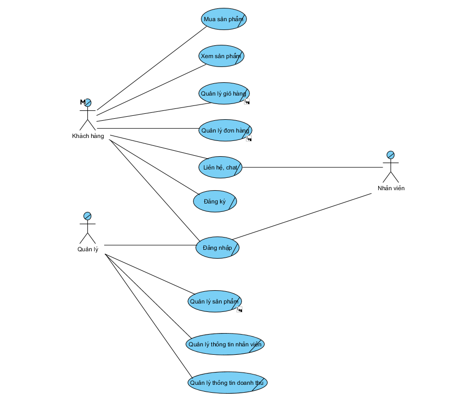
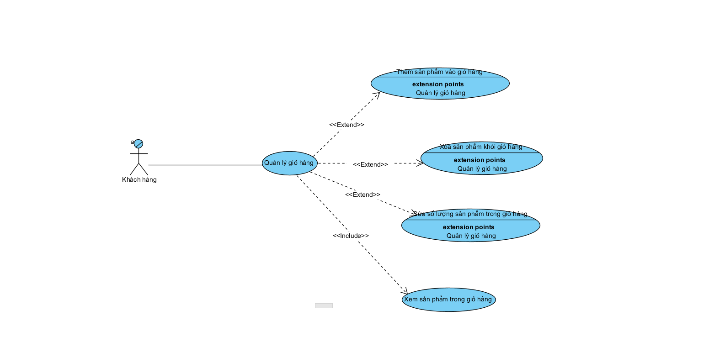
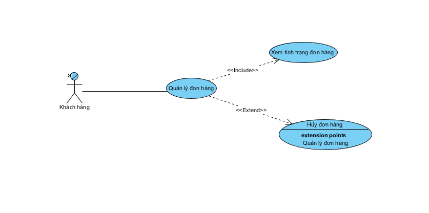
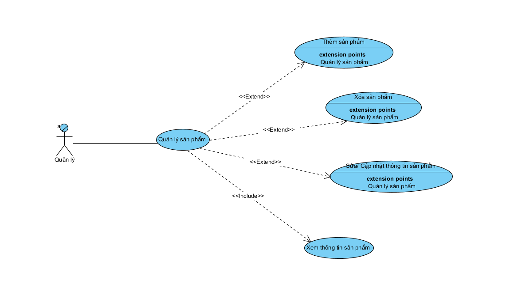
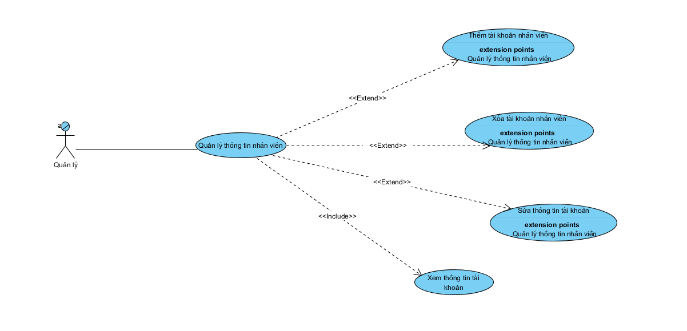
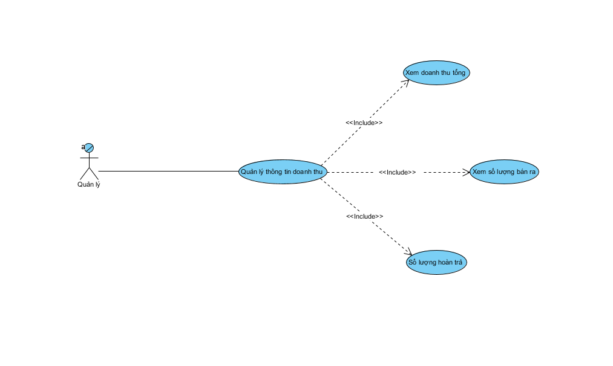

# Tài Liệu Phân Tích Thiết Kế Hệ Thống

Đề tài: Website Thương Mại Điện Tử - Bán Giày Thể Thao Chính Hãng 100%

## MỞ ĐẦU

### I. Tổng quan:

Ngày nay, công nghệ phát triển mạnh mẽ và đã trở thành một phần không thể thiếu trong đời sống con người. Nhờ những tiến bộ này, chúng ta tiết kiệm được đáng kể nguyên liệu, nhiên liệu, thời gian và công sức trong các lĩnh vực sản xuất, vận chuyển, lưu thông và quản lý hàng hóa. Sự chuyên môn hóa và tự động hóa ở từng công đoạn đã góp phần nâng cao hiệu suất lao động và mở ra những phương thức kinh doanh mới đầy tiềm năng.

Công tác quản lý và bán hàng cũng trở nên tiện lợi, hiệu quả hơn nhờ sự hỗ trợ của các thiết bị công nghệ như máy tính, điện thoại thông minh tích hợp các chuẩn kết nối hiện đại, và đặc biệt là các hệ thống website thương mại điện tử tích hợp nhiều tiện ích. Việc đưa cửa hàng lên không gian số không chỉ giúp tiếp cận khách hàng mọi lúc mọi nơi mà còn tối ưu hóa quy trình vận hành nội bộ.

Xuất phát từ nhu cầu mua sắm ngày càng cao và sự đa dạng về mẫu mã, kích cỡ trong thị trường thời trang, nhóm chúng em lựa chọn thực hiện đề tài  ***“Thiết kế website bán giày thể thao”*** . Hệ thống được kỳ vọng sẽ giúp tối ưu hóa quá trình quản lý kho hàng (theo size, màu sắc), tự động hóa quy trình đặt hàng và nâng cao trải nghiệm mua sắm trực tuyến, từ đó đáp ứng tốt hơn nhu cầu của khách hàng trong kỷ nguyên số.

Dựa trên yêu cầu ngày một cao hơn và sâu hơn của các cửa hàng kinh doanh thời trang, chúng em xin thực hiện đề tài cho môn Kỹ thuật phần mềm là thiết kế một hệ thống quản lý và kinh doanh trực tuyến, mà cụ thể ở đây là  ***Website bán giày thể thao** .*

### II. Mục tiêu đề tài.

Với thực trạng hiện nay, nhu cầu mua sắm thời trang và giày thể thao trực tuyến ngày càng tăng cao. Tuy nhiên, nhiều cửa hàng vẫn quản lý đơn hàng qua tin nhắn, sổ sách hoặc các hệ thống rời rạc, dẫn đến việc khó kiểm soát tồn kho theo size/màu và bỏ lỡ khách hàng tiềm năng. Website **“*Kinh doanh giày thể thao trực tuyến*”** ra đời nhằm mục đích số hóa toàn bộ quy trình bán hàng, từ khâu trưng bày sản phẩm trên nền tảng web đến khâu đặt hàng và quản lý vận chuyển, giúp công việc kinh doanh trở nên chuyên nghiệp, tự độngvà tiếp cận được tệp khách hàng rộng lớn hơn.

#### Mục tiêu của đề tài website kinh doanh giày thể thao trực tuyến là:

* **Nhanh chóng và Tiện lợi:** Khách hàng có thể dễ dàng tìm kiếm, lựa chọn và đặt mua các mẫu giày yêu thích mọi lúc, mọi nơi chỉ với vài thao tác click chuột. Hệ thống phản hồi tức thì về tình trạng hàng hóa, giúp rút ngắn tối đa thời
  gian mua sắm so với việc phải đến trực tiếp cửa hàng hoặc chờ đợi nhân viên tư vấn thủ công.
* **Chính xác và Minh bạch:** Hệ thống đảm bảo hiển thị thông tin sản phẩm chi tiết về thông số kỹ thuật, chất liệu, giá cả và đặc biệt là bảng size/màu sắc còn tồn kho thực tế. Quá trình tính toán hóa đơn, áp dụng mã giảm giá và
  phí vận chuyển được thực hiện tự động, đảm bảo tính chính xác và minh bạch tuyệt đối cho cả người mua và người bán.
* **Quản lý thông minh và Tập trung:** Người quản trị có thể dễ dàng quản lý danh mục hàng nghìn sản phẩm, theo dõi trạng thái đơn hàng và thông tin khách hàng thông qua hệ thống quản trị (Admin Dashboard). Các dữ liệu về doanh
  thu, sản phẩm bán chạy được thống kê trực quan, giúp chủ cửa hàng nắm bắt xu hướng thị trường và đưa ra chiến lược kinh doanh kịp thời.
* **Tối ưu hóa nguồn lực và Mở rộng thị trường:** Nhờ khả năng tự động hóa khâu tiếp nhận đơn hàng và thanh toán trực tuyến, website giúp giảm thiểu đáng kể khối lượng công việc cho nhân viên vận hành. Đồng thời, việc đưa cửa
  hàng lên môi trường internet giúp xóa bỏ rào cản địa lý, nâng cao năng suất bán hàng và tăng sức cạnh tranh trên thị trường.

### III. Xác định yêu cầu hệ thống:

1. **Yêu cầu chức năng:**

   Hệ thống quản lý bán giày thể thao chính hãng có chức năng
   lưu trữ và xử lý toàn bộ thông tin quan trọng phục vụ cho hoạt động kinh doanh
   hằng ngày, bao gồm dữ liệu về nhân viên, giày(size giày, mẫu mã, …), hóa đơn và
   các báo cáo thống kê. Việc quản lý thông tin đầy đủ và chính xác giúp cửa hàng
   hạn chế sai sót, tiết kiệm thời gian và tối ưu hiệu quả làm việc.

   **1.1 Quản lý nhập giày**

   •**1.1.1**. Thêm mới giày: Hệ thống cho phép thêm mới thông tin giày (tên, mã, hãng, giá nhập,size số, năm sản xuất, nhà cung cấp…).

   •**1.1.2**. Sửa thông tin giày: Hệ thống cho phép chỉnh sửa thông tin giày khi có sự thay đổi (giá cả, nhà cung cấp, hết size …).

   •**1.1.3**. Xóa giày: Hệ thống cho phép xóa giày khỏi kho trong trường hợp ngừng kinh doanh, hết size hoặc nhập sai dữ liệu.

   • **1.1.4**. Lập đơn mua: Hệ thống hỗ trợ lập đơn đặt hàng từ nhà cung cấp dựa trên nhu cầu tồn kho.

   •**1.1.5**. Lập phiếu nhập: Khi nhận giày từ nhà cung cấp, hệ thống cho phép lập phiếu nhập để cập nhật số lượng, giá nhập và tình trạng hàng vào kho.

   **1.2. Quản lý xuất giày**

   •**1.2.1** Kiểm tra yêu cầu: Hệ thống tiếp nhận và kiểm tra yêu cầu mua giày từ khách hàng.

   •**1.2.2**. Nhận đơn đặt hàng: Hệ thống ghi nhận đơn đặt hàng, lưu thông tin khách hàng, loại giày, size giày, số lượng và hình thức thanh toán.

   •**1.2.3**. Đối chiếu đơn: Hệ thống cho phép nhân viên kiểm tra, đối chiếu đơn hàng với tồn kho, xem giày có còn size hay mẫu mã có còn kinh doanh để đảm bảo chính xác.

   •**1.2.4**. Hóa đơn: Hệ thống hỗ trợ lập hóa đơn bán giày cho khách hàng, cập nhật số lượng giày trong kho và doanh thu.

   **1.3. Quản lý nhân viên**

   •**1.3.1**. Thêm mới nhân viên: Quản trị viên có thể thêm thông tin nhân viên mới (họ tên, tài khoản, chức vụ, liên hệ…).

   •**1.3.2**. Sửa thông tin: Cho phép chỉnh sửa thông tin nhân viên khi có thay đổi.

   •**1.3.3**. Xóa nhân viên: Hệ thống cho phép xóa tài khoản nhân viên khi nghỉ việc hoặc vi phạm.

   **1.4. Báo cáo**

   •**1.4.1**. Báo cáo doanh thu: Hệ thống thống kê doanh thu theo ngày, tháng, năm hoặc theo nhân viên bán hàng.

   •**1.4.2**. Báo cáo tồn kho: Thống kê số lượng giày còn lại trong kho, giày tồn k còn nguyên vẹn(ố màu, hỏng keo, rách,…), mẫu giày bán chạy/chậm.

   •**1.4.3**. Báo cáo khách hàng: Thống kê số lượng khách hàng mua hàng, lịch sử giao dịch và các thông tin liên quan.

   •**1.4.4**. Báo cáo danh sách nhà cung cấp: Hệ thống cho phép xem báo cáo về các nhà cung cấp, bao gồm số lần nhập, giá trị nhập, mức độ uy tín.
2. **Yêu cầu phi chức năng**:

   **2.1. Hiệu năng**

- Hệ thống phải đảm bảo tốc độ xử lý nhanh chóng, ổn định để đáp ứng nhu cầu phục vụ khách hàng.Mỗi giao dịch bán giày (từ lúc nhập thông tin đến khi in/xuất hóa đơn) cần được xử lý trong vòng < 10 giây, đảm bảo không gây gián đoạn cho nhân viên và khách hàng.
- Hệ thống có khả năng phục vụ đồng thời 50-100 người dùng trong cùng một thời điểm, bao gồm nhân viên bán hàng, nhân viên kho và quản lý, mà không bị treo máy, giật lag hay mất dữ liệu.
- Các thao tác tìm kiếm giày, tra cứu báo cáo và thống kê phải được trả kết quả ngay lập tức (thời gian phản hồi dưới 2 giây với truy vấn thông thường).

  **2.2. Bảo mật**
- Bảo mật thông tin là yếu tố then chốt của hệ thống quản lý bán giày thể thao.
- Người dùng bắt buộc phải đăng nhập bằng tài khoản và mật khẩu, có thể kết hợp với cơ chế OTP (One-Time Password) để thêm được mẫu giày vào giỏ hàng, thanh toán và bảo mật thông tin...
- Dữ liệu nhạy cảm như thông tin khách hàng, đơn mua giày hoặc dữ liệu kinh doanh phải được mã hóa trong cơ sở dữ liệu và trong quá trình truyền tải để tránh rò rỉ thông tin.
- Hệ thống cần có cơ chế phân quyền truy cập dữ liệu, đảm bảo mỗi nhân viên chỉ được phép truy cập vào phạm vi dữ liệu cần thiết cho công việc của mình.
- Cung cấp chức năng sao lưu dữ liệu tự động theo chu kỳ (hàng ngày/tuần/tháng) để phòng ngừa trường hợp mất mát hoặc hỏng hóc dữ liệu.

  **2.3. Độ tin cậy & Khả dụng**
- Hệ thống phải luôn trong trạng thái sẵn sàng phục vụ.
- Yêu cầu hoạt động 24/7 với độ sẵn sàng ≥ 99,9%, hạn chế tối đa tình trạng ngừng dịch vụ.
- Có cơ chế dự phòng và khôi phục dữ liệu sau sự cố, bao gồm chức năng backup – restore nhanh chóng, giúp đảm bảo không mất dữ liệu quan trọng trong trường hợp lỗi hệ thống hoặc sự cố phần cứng.
- Hệ thống phải chịu được các tình huống bất thường như mất điện, mạng chập chờn mà không gây hỏng cơ sở dữ liệu.

  **2.4. Khả năng mở rộng**
- Phần mềm phải được thiết kế theo hướng linh hoạt và dễ mở rộng.
- Có thể nâng cấp để quản lý cùng lúc nhiều chi nhánh cửa hàng và đồng bộ dữ liệu về một hệ thống trung tâm.
- Dễ dàng tích hợp với các phần mềm kế toán, quản lý nhân sự, hệ thống ngân hàng( trong trường hợp khách hàng mua trả góp) và các cổng thanh toán trực tuyến.
- Hỗ trợ khả năng mở rộng về cơ sở dữ liệu, có thể quản lý hàng triệu bản ghi khi quy mô cửa hàng phát triển.

  **2.5. Khả năng sử dụng**
- Hệ thống phải thân thiện, dễ dùng đối với nhân viên ở nhiều trình độ khác nhau.
- Giao diện đơn giản, trực quan, các chức năng được sắp xếp hợp lý để người dùng có thể thao tác nhanh mà không cần đào tạo quá nhiều.
- Hỗ trợ tìm kiếm mẫu giày nhanh theo mã, tên, hãng,...
- Có chức năng gợi ý tên giày tự động khi người dùng nhập từ khóa, giúp giảm sai sót khi nhập dữ liệu.
- Có khả năng hỗ trợ đa ngôn ngữ (tiếng Việt, tiếng Anh…) trong trường hợp cửa hàng có nhu cầu mở rộng hoặc phục vụ khách hàng quốc tế.

  **2.6. Bảo trì & Nâng cấp**
- Hệ thống cần dễ dàng bảo trì, sửa lỗi và cập nhật khi có yêu cầu mới.
- Cho phép cập nhật danh mục giày mới thường xuyên mà không làm gián đoạn hoạt động kinh doanh.
- Có khả năng nâng cấp lên phiên bản cao hơn của cơ sở dữ liệu, framework hoặc hệ điều hành mà không ảnh hưởng đến dữ liệu hiện tại.
- Hỗ trợ bảo trì từ xa, giúp đội ngũ kỹ thuật dễ dàng xử lý sự cố mà không mất nhiều thời gian.

  **2.7. Tuân thủ pháp lý**
- Hệ thống phải đảm bảo tuân thủ đầy đủ các quy định pháp luật liên quan đến lĩnh vực kinh doanh( đóng thuế doanh nghiệp, hàng nhập rõ nguồn gốc,…)
- Cam kết mẫu mã bán ra đều là hàng chính hãng và có bảo hành trong trường hợp khách hàng phát hiện giày fake.

### IV. Ý nghĩa của đề tài: Website Thương mại điện tử - Hệ thống bán giày thể thao chính hãng 100%

1. Ý nghĩa thực tiễn

   Trong bối cảnh thương mại điện tử đang phát triển mạnh mẽ và nhu cầu sở hữu giày thể thao chính hãng ngày càng cao, việc xây dựng hệ thống website bán giày thể thao mang lại những giá trị thiết thực sau:

   * Đối với doanh nghiệp/Cửa hàng:
     * Tự động hóa và tối ưu quy trình: Chuyển đổi mô hình quản lý thủ công sang quy trình số hóa hoàn toàn, giúp tiết kiệm chi phí nhân sự và thời gian vận hành.
     * Quản lý hiệu quả: Cung cấp công cụ đắc lực cho người quản trị (Admin) trong việc theo dõi hàng tồn kho, cập nhật sản phẩm (CRUD) và thống kê doanh thu chính xác, minh bạch.
     * Nâng cao chất lượng dịch vụ: Tính năng phản hồi chatbox giúp cửa hàng tương tác, hỗ trợ khách hàng kịp thời, từ đó gia tăng tỷ lệ chốt đơn và sự hài lòng của khách hàng.
   * Đối với khách hàng:
     * Tiếp cận nguồn hàng uy tín: Giải quyết nỗi lo về hàng giả, hàng nhái thông qua cam kết "100% chính hãng", tạo dựng niềm tin cho người tiêu dùng trực tuyến.
     * Trải nghiệm mua sắm tiện lợi: Khách hàng có thể xem, lựa chọn và mua sắm mọi lúc mọi nơi với giao diện trực quan, hiện đại.
     * Hỗ trợ nhanh chóng: Hệ thống chat trực tuyến giúp người mua được giải đáp thắc mắc về size giày, mẫu mã ngay lập tức mà không cần chờ đợi lâu.
2. Ý nghĩa khoa học và học tập

   Việc thực hiện đề tài không chỉ dừng lại ở một sản phẩm ứng dụng mà còn là cơ hội để áp dụng và kiểm chứng các kiến thức công nghệ thông tin vào thực tế:

   * Làm chủ công nghệ hiện đại: Đề tài là cơ hội để nghiên cứu sâu và ứng dụng bộ công nghệ phổ biến nhất hiện nay:
     * Front-end: Xây dựng giao diện Responsive, thẩm mỹ cao với React.js và TailwinCSS.
     * Back-end: Xây dựng API mạnh mẽ, bảo mật với Node.js, Express; sử dụng TypeScript để đảm bảo tính chặt chẽ của mã nguồn.
     * Database: Thiết kế và quản trị cơ sở dữ liệu phi quan hệ (NoSQL) với MongoDB.
   * Ứng dụng ký thuật Real-Time: Nghiên cứu và triển khai công nghệ WebSocket để xây dựng tính năng Chat trực tuyến, một yêu cầu quan trọng của các hệ thống web hiện đại.
   * Reàn luyện tư duy Phân tích thiết kế thuật hệ thống: Nâng cao kỹ năng phân tích yêu cầu, mô hình hóa dữ liệu, thiết kế sơ đồ luồng dữ liệu (DFD) và sơ đồ thực thể liên kết (ERD) để đảm bảo hệ thống hoạt động logic và ổn định.

### V. Xác định phạm vi và đối tưởng sử dụng hệ thống

1. Đối tượng sử dụng hệ thống
   a, Nhóm khách hàng

   - Khách vãng lai(Guest):

     - Người chưa đăng kí tài khoản
     - Nhu cầu: Tìm kiếm nhanh, xem mẫu mã, so sánh giá, muốn mua hàng nhanh (checkout không cần đăng nhập)
   - Thành viên (member):

     - Người đã có tài khoản
     - Nhu cầu: Lưu trữ lịch sử mua hàng, tích điểm, nhận mã giảm giá, lưu địa chỉ giao hàng để không phải nhập lại
   - Phân khúc khách hàng và mục tiêu:

     - Người sưu tập giày: Quan tâm đến những sản phẩm limited, ngày phát hành, tính xác thực
     - Người chơi thể thao: Quan tâm đến hiệu năng, công nghệ đế, độ êm, hỗ trợ vận động khi chơi thể thao
     - Người đam mê thời trang: Quan tâm mẫu mã đẹp, giá cả, độ thịnh hành

   b, Nhóm quản trị viên

   - Admin: Có toàn quyền hệ thống, tạo tài khoản cho nhân viên, xem báo cáo doanh thu tổng quan
   - Nhân viên bán hàng / Quản lý: Tiếp nhận đơn hàng, xác nhận đơn, hỗ trợ khách qua chat, cập nhật trạng thái giao hàng, viết bài blog, đăng sản phẩm, quản lý số lượng tồn kho, nhập hàng mới, cập nhật size/màu sắc còn hay hết
2. Phạm vi hệ thống

   a, Mục tiêu phạm vi hệ thống:

   - Hệ thống website bán giày thể thao được xây dựng nhằm:
     - Tin học hóa quy trình bán giày thể thao trực tuyến.
     - Hỗ trợ khách hàng tìm kiếm, lựa chọn và mua sản phẩm qua Internet.
     - Hỗ trợ quản lý cửa hàng trong việc quản lý sản phẩm, đơn hàng và khách hàng.
     - Cung cấp thông tin phục vụ công tác thống kê và ra quyết định quản lý.

   b, Ranh giới

   - Ranh giới hệ thống Hệ thống bao gồm các nghiệp vụ bán hàng trực tuyến thông qua website và không bao gồm các nghiệp vụ bán hàng trực tiếp tại cửa hàng.
   - Hệ thống đóng vai trò trung gian giữa:
     - Khách hàng
     - Nhân viên / Quản lý

   c, Phạm vi chức năng của hệ thống

   - Nhóm chức năng dành cho khách hàng:
     - Xem danh sách sản phẩm và thông tin chi tiết sản phẩm.
     - Tìm kiếm, lọc và sắp xếp giày theo các tiêu chí.
     - Đăng ký, đăng nhập và quản lý thông tin cá nhân.
     - Thêm sản phẩm vào giỏ hàng và tạo đơn đặt hàng.
     - Lựa chọn phương thức thanh toán.
     - Theo dõi trạng thái đơn hàng và lịch sử mua hàng.
   - Nhóm chức năng dành cho nhân viên / quản lý
     - Quản lý danh mục sản phẩm và thương hiệu.
     - Thêm, sửa, xóa thông tin sản phẩm.
     - Quản lý tồn kho. Xử lý và cập nhật trạng thái đơn hàng.
     - Quản lý thông tin khách hàng.
     - Thống kê doanh thu, số lượng bán ra.
   - Nhóm chức năng dành cho quản trị hệ thống
     - Quản lý tài khoản người dùng và phân quyền.
     - Cấu hình hệ thống.
     - Sao lưu và bảo mật dữ liệu.
   - Phạm vi dữ liệu của hệ thống
     - Hệ thống quản lý các nhóm dữ liệu chính:
       - Dữ liệu sản phẩm (giày, thương hiệu, kích cỡ, giá bán).
       - Dữ liệu khách hàng (tài khoản, thông tin liên hệ).
       - Dữ liệu đơn hàng (giỏ hàng, hóa đơn, trạng thái).
       - Dữ liệu thanh toán và giao hàng.
       - Dữ liệu thống kê, báo cáo.
   - Phạm vi các tác nhân (Actor)
     - Khách hàng: người sử dụng website để mua giày.
     - Nhân viên bán hàng: xử lý đơn hàng và quản lý sản phẩm.
     - Quản trị viên: quản lý và duy trì hệ thống.
   - Phạm vi triển khai
     - Hệ thống được triển khai trên nền tảng web.
     - Người dùng truy cập thông qua trình duyệt Internet.
     - Phạm vi phục vụ chủ yếu trong lãnh thổ Việt Nam

### VI. Các công nghệ sử dụng cho chương trình website

1. React.js

- ReactJS là một opensource được phát triển bởi Facebook, ra mắt vào năm 2013, bản thân nó là một thư viện Javascript được dùng để để xây dựng các tương tác với các thành phần trên website. Một trong những điểm nổi bật nhất của ReactJS đó là việc render dữ liệu không chỉ thực hiện được trên tầng Server mà còn ở dưới Client nữa.
- Link: [https://viblo.asia/p/reactjs-la-gi-nhung-dieu-co-the-ban-chua-biet-ve-reactjs-eW65G4RRKDO](https://viblo.asia/p/reactjs-la-gi-nhung-dieu-co-the-ban-chua-biet-ve-reactjs-eW65G4RRKDO)

2. Tailwind CSS

- Tailwind CSS là một framework CSS hiện đại theo hướng “utility-first”, cho phép lập trình viên xây dựng giao diện web bằng cách sử dụng các lớp tiện ích nhỏ gọn (utility classes) thay vì viết CSS thủ công hoặc dựa vào các thành phần thiết kế sẵn.
- Link: [https://www.careerlink.vn/cam-nang-viec-lam/tu-van-nghe-nghiep/tailwind-css-la-gi](https://www.careerlink.vn/cam-nang-viec-lam/tu-van-nghe-nghiep/tailwind-css-la-gi)

3. Node.js

- Nodejs là một môi trường runtime chạy [JavaScript](https://200lab.io/blog/javascript-la-gi/) đa nền tảng, open-source (mã nguồn mở), được sử dụng rộng rãi bởi lập trình viên cho nhiều dự án. Nodejs cung cấp nhiều thư viện khác nhau, giúp đơn giản hóa việc lập trình.
- Link: [https://200lab.io/blog/nodejs-la-gi](https://200lab.io/blog/nodejs-la-gi)

4. Express.js

- Express.js là một framework phổ biến được sử dụng để xây dựng ứng dụng web và API thông qua Node.js. Nền tảng được xem là một phương thức xử lý các yêu cầu HTTP, quản lý các tuyến đường, xử lý phần mềm trung gian và nhiều tính năng khác để phát triển hiệu quả ứng dụng web.
- Express.js tập trung vào công việc tối ưu hóa việc xây dựng web ứng dụng bằng cách cung cấp một cấu trúc hoạt động và chỉ định rõ ràng việc xử lý yêu cầu và phản hồi. Nền tảng cũng hỗ trợ tích hợp các phần mềm trung gian bên ngoài để mở rộng chức năng của ứng dụng.
- Với cộng đồng lớn và phổ biến, Express.js đã trở thành một trong những lựa chọn phổ biến để phát triển ứng dụng web và API trên nền tảng Node.js.
- Link: [https://fptshop.com.vn/tin-tuc/danh-gia/express-js-la-gi-174976](https://fptshop.com.vn/tin-tuc/danh-gia/express-js-la-gi-174976)

5. JWT

- JSON Web Token (JWT) là một tiêu chuẩn mở ([RFC 7519](https://tools.ietf.org/html/rfc7519)) nhằm xác minh thông tin an toàn giữa các bên Client-Server dưới dạng JSON object. Thông tin này có thể được xác minh và tin cậy vì nó được ký điện tử - digitally signed. JWT có thể được ký bằng cách sử dụng một secret (với thuật toán HMAC) hoặc cặp public/private key dùng chuẩn RSA hoặc ECDSA.
- Signed tokens có thể xác minh tính toàn vẹn của các claim có trong đó, trong khi encrypted tokens ẩn các claim từ các bên khác. Khi token được đăng ký bởi các cặp public/private keys, signature cũng xác nhận rằng chỉ có bên giữ private key là nơi đã đăng ký nó.
- Link: [https://viblo.asia/p/json-web-token-la-gi-aWj533go56m](https://viblo.asia/p/json-web-token-la-gi-aWj533go56m)

6. WebSocket

- WebSocket được biết đến rộng rãi như một giao thức phổ biến trong các ứng dụng thời gian thực, nhằm trao đổi thông tin trực tuyến hai chiều và liên tục giữa client và server, client và client.
- WebSocket được biết đến rộng rãi như một giao thức phổ biến trong các ứng dụng thời gian thực, nhằm trao đổi thông tin trực tuyến hai chiều và liên tục giữa client và server, client và client.
- Link: [https://200lab.io/blog/websocket-la-gi](https://200lab.io/blog/websocket-la-gi)

7. MongoDB

- MongoDB là một hệ thống quản lý cơ sở dữ liệu (DBMS) phi quan hệ, mã nguồn mở, được phát triển dựa trên cơ sở dữ liệu NoSQL. Công nghệ tiếp cận vấn đề lưu trữ và truy xuất dữ liệu một cách linh hoạt hơn so với cơ sở dữ liệu quan hệ truyền thống. MongoDB lưu trữ dữ liệu dưới dạng cặp khóa-giá trị, cấu trúc dữ liệu tài liệu hoặc bảng.
- MongoDB có khả năng mở rộng và linh hoạt trong việc xử lý dữ liệu phi cấu trúc. Nền tảng hỗ trợ truy vấn dữ liệu phức tạp thông qua việc sử dụng các câu truy vấn dựa trên trình xây dựng.
- Những điểm nổi bật của MongoDB bao gồm khả năng lưu trữ dữ liệu dưới dạng tài liệu JSON linh hoạt, hỗ trợ cho các tính năng như replica set và sharding. Ngoài ra, công cụ còn cung cấp cơ chế tìm kiếm và truy vấn linh hoạt.
- Link: [https://fptshop.com.vn/tin-tuc/danh-gia/mongodb-la-gi-167784](https://fptshop.com.vn/tin-tuc/danh-gia/mongodb-la-gi-167784)

8. Mongoose

- Mongoose là một thư viện JavaScript cho phép định nghĩa các schema với dữ liệu được định kiểu rõ ràng. Khi một schema được định nghĩa, Mongoose cho phép tạo một Model dựa trên một schema cụ thể. Model của Mongoose sau đó được ánh xạ tới một MongoDB document thông qua định nghĩa schema của Model.
- Link: https://code.tutsplus.com/vi/an-introduction-to-mongoose-for-mongodb-and-nodejs--cms-29527a

## Phân tích thiết kế hệ thống

1. Giải pháp

- Từ những hạn chế và khó khăn của phương thức bán hàng truyền thống đã nêu ở phần trên, mục tiêu chính của website bán giày thể thao là xây dựng một hệ thống kinh doanh trực tuyến hiện đại nhằm phục vụ khách hàng một cách nhanh chóng, tiện lợi và chính xác nhất. Website giúp khách hàng dễ dàng tra cứu thông tin sản phẩm, lựa chọn mẫu mã, kích cỡ, đặt hàng và thanh toán trực tuyến mà không mất nhiều thời gian chờ đợi hay xảy ra sai sót trong quá trình mua bán. Bên cạnh đó, hệ thống còn hỗ trợ giảm tải khối lượng công việc cho nhân viên thông qua việc tự động hóa các khâu quản lý đơn hàng, khách hàng và tồn kho, đồng thời cho phép thống kê, lập hóa đơn và báo cáo doanh thu một cách nhanh chóng, chính xác và hiệu quả.
- Giải pháp để thực hiện mục tiêu của hệ thống là xây dựng đầy đủ các chức năng quản lý việc nhập – xuất giày thể thao một cách chặt chẽ và hoàn thiện:

  - Việc hoàn thiện các chức năng trong quá trình quản lý nhập kho, xuất kho và bán hàng sẽ giúp cho công tác quản lý của nhân viên cửa hàng trở nên dễ dàng và thuận tiện hơn. Nhân viên có thể nhanh chóng kiểm tra số lượng tồn kho, mẫu mã, kích cỡ giày và tư vấn cho khách hàng một cách chính xác.
  - Bên cạnh đó, việc tra cứu thông tin đơn hàng cũng như lập hóa đơn điện tử một cách dễ dàng sẽ giúp cửa hàng nắm bắt tình hình kinh doanh nhanh chóng và chính xác. Công việc này có thể được thực hiện thường xuyên, mọi lúc mọi nơi, từ đó hỗ trợ hiệu quả cho việc điều chỉnh và xây dựng chiến lược kinh doanh phù hợp.
- Với những chức năng trên, hầu hết các hạn chế của hệ thống cũ sẽ được khắc phục, đồng thời hệ thống mới mang lại các ưu điểm nổi bật sau:

  - Nhanh chóng và thuận tiện.
  - Chính xác và đầy đủ.
  - Quản lý dễ dàng.
  - Giảm tải khối lượng công việc cho nhân viên.

2. Mô hình hóa
   1. Mô hình Business Use-case
   
   2. Mô hình SUB_Quản lý giỏ hàng
   
   3. Mô hình SUB_Quản lý đơn hàng
   
   4. Mô hình SUB_Quản lý sản phẩm
   
   5. Mô hình SUB_Quản lý thông tin nhân viên
   
   6. Mô hình SUB_Quản lý thông tin doanh thu
   
  
