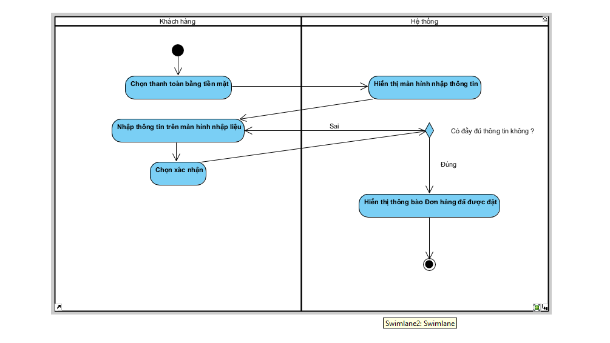
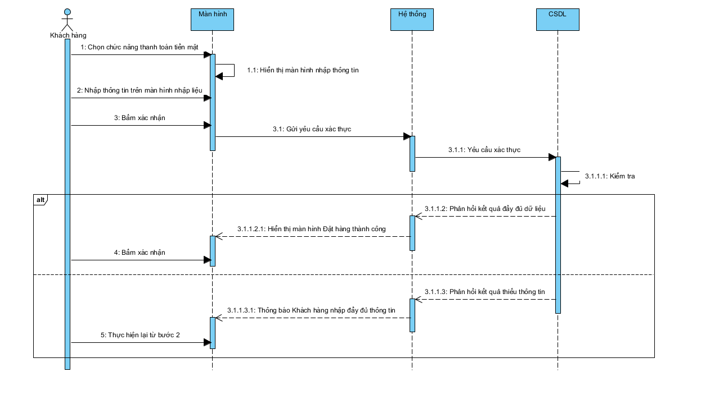
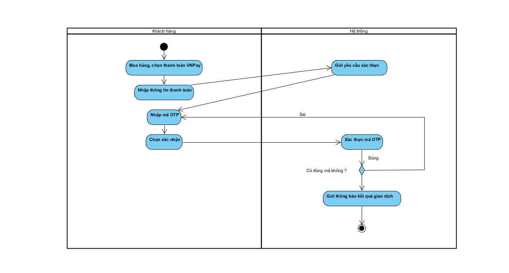
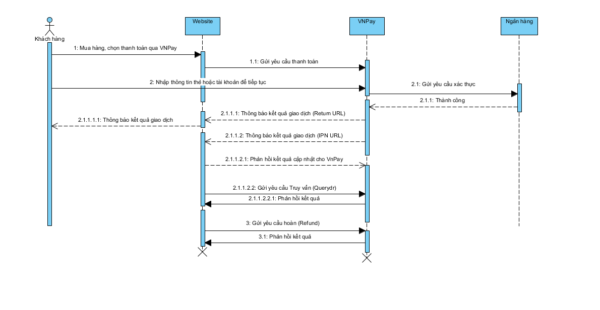
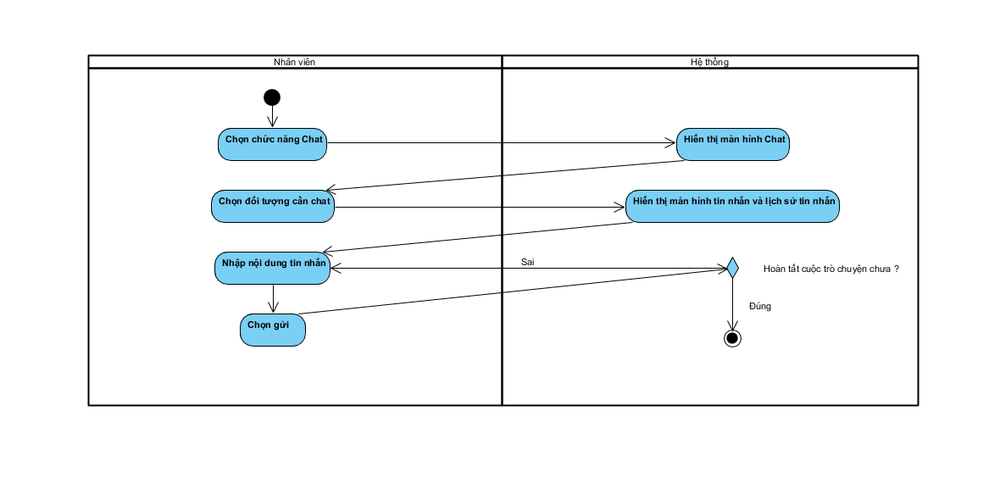
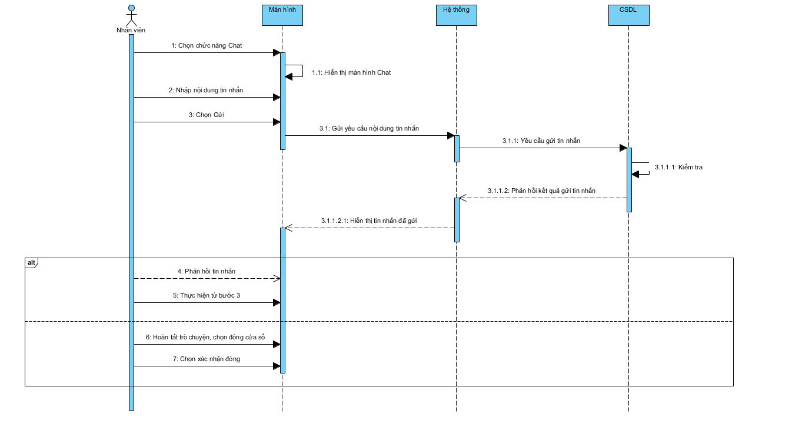

# Tài Liệu Phân Tích Thiết Kế Hệ Thống

Đề tài: Website Thương Mại Điện Tử - Bán Giày Thể Thao Chính Hãng 100%

## MỞ ĐẦU

### I. Tổng quan:

Ngày nay, công nghệ phát triển mạnh mẽ và đã trở thành một phần không thể thiếu trong đời sống con người. Nhờ những tiến bộ này, chúng ta tiết kiệm được đáng kể nguyên liệu, nhiên liệu, thời gian và công sức trong các lĩnh vực sản xuất, vận chuyển, lưu thông và quản lý hàng hóa. Sự chuyên môn hóa và tự động hóa ở từng công đoạn đã góp phần nâng cao hiệu suất lao động và mở ra những phương thức kinh doanh mới đầy tiềm năng.

Công tác quản lý và bán hàng cũng trở nên tiện lợi, hiệu quả hơn nhờ sự hỗ trợ của các thiết bị công nghệ như máy tính, điện thoại thông minh tích hợp các chuẩn kết nối hiện đại, và đặc biệt là các hệ thống website thương mại điện tử tích hợp nhiều tiện ích. Việc đưa cửa hàng lên không gian số không chỉ giúp tiếp cận khách hàng mọi lúc mọi nơi mà còn tối ưu hóa quy trình vận hành nội bộ.

Xuất phát từ nhu cầu mua sắm ngày càng cao và sự đa dạng về mẫu mã, kích cỡ trong thị trường thời trang, nhóm chúng em lựa chọn thực hiện đề tài  ***“Thiết kế website bán giày thể thao”*** . Hệ thống được kỳ vọng sẽ giúp tối ưu hóa quá trình quản lý kho hàng (theo size, màu sắc), tự động hóa quy trình đặt hàng và nâng cao trải nghiệm mua sắm trực tuyến, từ đó đáp ứng tốt hơn nhu cầu của khách hàng trong kỷ nguyên số.

Dựa trên yêu cầu ngày một cao hơn và sâu hơn của các cửa hàng kinh doanh thời trang, chúng em xin thực hiện đề tài cho môn Kỹ thuật phần mềm là thiết kế một hệ thống quản lý và kinh doanh trực tuyến, mà cụ thể ở đây là  ***Website bán giày thể thao** .*

### II. Mục tiêu đề tài.

Với thực trạng hiện nay, nhu cầu mua sắm thời trang và giày thể thao trực tuyến ngày càng tăng cao. Tuy nhiên, nhiều cửa hàng vẫn quản lý đơn hàng qua tin nhắn, sổ sách hoặc các hệ thống rời rạc, dẫn đến việc khó kiểm soát tồn kho theo size/màu và bỏ lỡ khách hàng tiềm năng. Website **“*Kinh doanh giày thể thao trực tuyến*”** ra đời nhằm mục đích số hóa toàn bộ quy trình bán hàng, từ khâu trưng bày sản phẩm trên nền tảng web đến khâu đặt hàng và quản lý vận chuyển, giúp công việc kinh doanh trở nên chuyên nghiệp, tự độngvà tiếp cận được tệp khách hàng rộng lớn hơn.

#### Mục tiêu của đề tài website kinh doanh giày thể thao trực tuyến là:

* **Nhanh chóng và Tiện lợi:** Khách hàng có thể dễ dàng tìm kiếm, lựa chọn và đặt mua các mẫu giày yêu thích mọi lúc, mọi nơi chỉ với vài thao tác click chuột. Hệ thống phản hồi tức thì về tình trạng hàng hóa, giúp rút ngắn tối đa thời
  gian mua sắm so với việc phải đến trực tiếp cửa hàng hoặc chờ đợi nhân viên tư vấn thủ công.
* **Chính xác và Minh bạch:** Hệ thống đảm bảo hiển thị thông tin sản phẩm chi tiết về thông số kỹ thuật, chất liệu, giá cả và đặc biệt là bảng size/màu sắc còn tồn kho thực tế. Quá trình tính toán hóa đơn, áp dụng mã giảm giá và
  phí vận chuyển được thực hiện tự động, đảm bảo tính chính xác và minh bạch tuyệt đối cho cả người mua và người bán.
* **Quản lý thông minh và Tập trung:** Người quản trị có thể dễ dàng quản lý danh mục hàng nghìn sản phẩm, theo dõi trạng thái đơn hàng và thông tin khách hàng thông qua hệ thống quản trị (Admin Dashboard). Các dữ liệu về doanh
  thu, sản phẩm bán chạy được thống kê trực quan, giúp chủ cửa hàng nắm bắt xu hướng thị trường và đưa ra chiến lược kinh doanh kịp thời.
* **Tối ưu hóa nguồn lực và Mở rộng thị trường:** Nhờ khả năng tự động hóa khâu tiếp nhận đơn hàng và thanh toán trực tuyến, website giúp giảm thiểu đáng kể khối lượng công việc cho nhân viên vận hành. Đồng thời, việc đưa cửa
  hàng lên môi trường internet giúp xóa bỏ rào cản địa lý, nâng cao năng suất bán hàng và tăng sức cạnh tranh trên thị trường.

### III. Xác định yêu cầu hệ thống:

**I.Yêu cầu chức năng:**

Hệ thống website bán giày thể thao đóng vai trò là kênh bán hàng trực tuyến và quản lý vận hành tập trung. Hệ thống hỗ trợ người dùng từ khâu tìm kiếm, lựa chọn sản phẩm đến thanh toán, đồng thời cung cấp
công cụ quản trị mạnh mẽ để kiểm soát kho hàng, doanh thu và tương tác khách hàng.

**1.Quản lý dành cho người dùng (user/khách hàng)**

* Tài khoản:  Hệ thống cho phép khách hàng đăng ký tài khoản mới và đăng nhập để sử dụng các tính năng cá nhân hóa.

**1.1 Mua sắm và giỏ hàng:**

* Xem danh sách và chi tiết sản phẩm (hình ảnh, mô tả, giá, bảng size).
* Thêm sản phẩm vào giỏ hàng, cập nhật số lượng hoặc xóa sản phẩm.
* Xem danh sách giỏ hàng hiện tại trước khi tiến hành thanh toán.

**1.2 Thanh toán:**

* Hỗ trợ đa dạng phương thức thanh toán bao gồm: Thanh toán qua cổng **VNPay** và thanh toán khi nhận hàng ( **Tiền mặt** ).

**1.3 Theo dõi đơn hàng:**

* Xem lịch sử mua hàng cá nhân.
* Theo dõi tình trạng đơn hàng thời gian thực (Chờ xác nhận, Đang giao, Đã giao, Đã hủy).

**1.4 Hỗ trợ và đổi trả:**

* Hệ thống quản lý bán giày thể thao chính hãng có chức năng lưu trữ và xử lý toàn bộ thông tin quan trọng phục vụ cho hoạt động kinh doanh hằng ngày, bao gồm dữ liệu về nhân viên, giày(size giày, mẫu mã, …), hóa đơn và các báo cáo thống kê. Việc quản lý thông tin đầy đủ và chính xác giúp cửa hàng hạn chế sai sót, tiết kiệm thời gian và tối ưu hiệu quả làm việc.
* Liên hệ chat trực tuyến với nhân viên hỗ trợ.
* Gửi yêu cầu và thông tin liên hệ để thực hiện đổi trả sản phẩm theo chính sách.

**2.Quản lý dành cho Quản trị viên (Admin/Service)**

**2.1.Quản lý sản phẩm (CRUD) :**

* Thêm mới, chỉnh sửa, xóa và hiển thị thông tin các mẫu giày.

**2.2.Quản lý kho hàng chuyên sâu:**

* Hệ thống phải hiển thị chi tiết trạng thái còn hàng/hết hàng theo từng **Size** cụ thể của từng mã sản phẩm.

**2.3.Quản lý đơn hàng**:

* Tiếp nhận đơn hàng từ khách hàng, cập nhật trạng thái xử lý và vận chuyển.

**2.4.Tương tác với khách hàng:**

* Tiếp nhận và phản hồi tin nhắn từ khung chatbox để hỗ trợ khách hàng kịp thời.

**2.5.Báo cáo và thống kê:**

* Thống kê doanh thu: Tổng hợp số tiền thu được theo ngày, tháng, năm.
* Thống kê sản lượng: Báo cáo số lượng giày bán ra theo các mốc thời gian (Tuần, Tháng, Năm) để đánh giá xu hướng thị trường.

**II.Yêu cầu phi chức năng.**

1. **Hiệu năng:**

* Tốc độ xử lý: Các thao tác cơ bản (tìm kiếm giày, thêm vào giỏ hàng) phải phản hồi trong vòng < 2 giây.
* Giao dịch thanh toán: Quá trình xử lý đơn hàng và chuyển hướng sang cổng VNPay không quá 5 giây (tùy thuộc vào tốc độ API bên thứ ba).
* Khả năng chịu tải: Đáp ứng tốt tối thiểu 50 người dùng hoạt động cùng lúc mà không xảy ra hiện tượng mất dữ liệu giỏ hàng hoặc sai lệch tồn kho.
* Tối ưu hóa hình ảnh: Hình ảnh sản phẩm (giày thường có độ phân giải cao) phải được nén hoặc xử lý lazy-loading để không làm chậm tốc độ tải trang trên thiết bị di động

2. **Bảo mật:**

* Toàn bộ thông tin tài khoản và mật khẩu khách hàng phải được mã hóa (hashing).
* Các giao dịch qua cổng VNPay phải đảm bảo tuân thủ tiêu chuẩn bảo mật tài chính, đảm bảo không rò rỉ dữ liệu thẻ của khách hàng.
* Phân quyền chặt chẽ: Nhân viên tư vấn chỉ có quyền chat và xem đơn hàng, trong khi quản trị viên cao cấp mới có quyền can thiệp vào dữ liệu doanh thu và xóa sản phẩm.

3. **Độ tin cậy & khả dụng:**

* Hệ thống hoạt động 24/7 để khách hàng có thể đặt hàng bất cứ lúc nào. Độ sẵn sàng đạt 99.9%
* Dữ liệu đơn hàng và thông tin khách hàng phải được sao lưu tự động hàng ngày để đảm bảo có thể khôi phục ngay khi gặp sự cố máy chủ.
* Đảm bảo tính nhất quán dữ liệu: Khi khách hàng thanh toán thành công, số lượng hàng trong kho (theo size) phải được trừ đi tương ứng ngay lập tức.

4. **Khả năng mở rộng**

* Cấu trúc mã nguồn linh hoạt, dễ dàng tích hợp thêm các đơn vị vận chuyển (GHTK, GHN...) hoặc các ví điện tử khác trong tương lai.
* Khả năng mở rộng danh mục sang các phụ kiện thể thao khác mà không cần thay đổi cấu trúc nền tảng.

5. **Khả năng sử dụng:**

* Giao diện người dùng (UI) hiện đại, trẻ trung, phù hợp với phong cách thời trang thể thao.
* Trải nghiệm người dùng (UX) tối ưu trên cả thiết bị di động (Responsive Design) vì phần lớn khách hàng mua sắm qua điện thoại.
* Chức năng lọc sản phẩm (theo giá, size, màu sắc) và tìm kiếm thông minh giúp người dùng tìm thấy đôi giày mong muốn nhanh nhất.

6. **Bảo trì & Nâng cấp:**

* Hệ thống được thiết kế theo module để dễ dàng cập nhật các tính năng mới (ví dụ: hệ thống tích điểm thành viên) mà không ảnh hưởng đến các chức năng hiện có.
* Hỗ trợ công cụ quản lý log để phát hiện và xử lý lỗi phát sinh từ phía người dùng một cách nhanh chóng.

7. **Tuân thủ pháp lý:**

* Tuân thủ các quy định về thương mại điện tử của Nhà nước (đăng ký với Bộ Công Thương).
* Đảm bảo chính sách bảo mật thông tin cá nhân khách hàng theo quy định pháp luật.
* Hiển thị rõ ràng các thông tin về giá, chính sách đổi trả và bảo hành sản phẩm.

### IV. Ý nghĩa của đề tài: Website Thương mại điện tử - Hệ thống bán giày thể thao chính hãng 100%

1. Ý nghĩa thực tiễn

   Trong bối cảnh thương mại điện tử đang phát triển mạnh mẽ và nhu cầu sở hữu giày thể thao chính hãng ngày càng cao, việc xây dựng hệ thống website bán giày thể thao mang lại những giá trị thiết thực sau:

   * Đối với doanh nghiệp/Cửa hàng:
     * Tự động hóa và tối ưu quy trình: Chuyển đổi mô hình quản lý thủ công sang quy trình số hóa hoàn toàn, giúp tiết kiệm chi phí nhân sự và thời gian vận hành.
     * Quản lý hiệu quả: Cung cấp công cụ đắc lực cho người quản trị (Admin) trong việc theo dõi hàng tồn kho, cập nhật sản phẩm (CRUD) và thống kê doanh thu chính xác, minh bạch.
     * Nâng cao chất lượng dịch vụ: Tính năng phản hồi chatbox giúp cửa hàng tương tác, hỗ trợ khách hàng kịp thời, từ đó gia tăng tỷ lệ chốt đơn và sự hài lòng của khách hàng.
   * Đối với khách hàng:
     * Tiếp cận nguồn hàng uy tín: Giải quyết nỗi lo về hàng giả, hàng nhái thông qua cam kết "100% chính hãng", tạo dựng niềm tin cho người tiêu dùng trực tuyến.
     * Trải nghiệm mua sắm tiện lợi: Khách hàng có thể xem, lựa chọn và mua sắm mọi lúc mọi nơi với giao diện trực quan, hiện đại.
     * Hỗ trợ nhanh chóng: Hệ thống chat trực tuyến giúp người mua được giải đáp thắc mắc về size giày, mẫu mã ngay lập tức mà không cần chờ đợi lâu.
2. Ý nghĩa khoa học và học tập

   Việc thực hiện đề tài không chỉ dừng lại ở một sản phẩm ứng dụng mà còn là cơ hội để áp dụng và kiểm chứng các kiến thức công nghệ thông tin vào thực tế:

   * Làm chủ công nghệ hiện đại: Đề tài là cơ hội để nghiên cứu sâu và ứng dụng bộ công nghệ phổ biến nhất hiện nay:
     * Front-end: Xây dựng giao diện Responsive, thẩm mỹ cao với React.js và TailwinCSS.
     * Back-end: Xây dựng API mạnh mẽ, bảo mật với Node.js, Express; sử dụng TypeScript để đảm bảo tính chặt chẽ của mã nguồn.
     * Database: Thiết kế và quản trị cơ sở dữ liệu phi quan hệ (NoSQL) với MongoDB.
   * Ứng dụng ký thuật Real-Time: Nghiên cứu và triển khai công nghệ WebSocket để xây dựng tính năng Chat trực tuyến, một yêu cầu quan trọng của các hệ thống web hiện đại.
   * Reàn luyện tư duy Phân tích thiết kế thuật hệ thống: Nâng cao kỹ năng phân tích yêu cầu, mô hình hóa dữ liệu, thiết kế sơ đồ luồng dữ liệu (DFD) và sơ đồ thực thể liên kết (ERD) để đảm bảo hệ thống hoạt động logic và ổn định.

### V. Xác định phạm vi và đối tưởng sử dụng hệ thống

1. Đối tượng sử dụng hệ thống
   a, Nhóm khách hàng

   - Khách vãng lai(Guest):

     - Người chưa đăng kí tài khoản
     - Nhu cầu: Tìm kiếm nhanh, xem mẫu mã, so sánh giá, muốn mua hàng nhanh (checkout không cần đăng nhập)
   - Thành viên (member):

     - Người đã có tài khoản
     - Nhu cầu: Lưu trữ lịch sử mua hàng, tích điểm, nhận mã giảm giá, lưu địa chỉ giao hàng để không phải nhập lại
   - Phân khúc khách hàng và mục tiêu:

     - Người sưu tập giày: Quan tâm đến những sản phẩm limited, ngày phát hành, tính xác thực
     - Người chơi thể thao: Quan tâm đến hiệu năng, công nghệ đế, độ êm, hỗ trợ vận động khi chơi thể thao
     - Người đam mê thời trang: Quan tâm mẫu mã đẹp, giá cả, độ thịnh hành

   b, Nhóm quản trị viên

   - Admin: Có toàn quyền hệ thống, tạo tài khoản cho nhân viên, xem báo cáo doanh thu tổng quan
   - Nhân viên bán hàng / Quản lý: Tiếp nhận đơn hàng, xác nhận đơn, hỗ trợ khách qua chat, cập nhật trạng thái giao hàng, viết bài blog, đăng sản phẩm, quản lý số lượng tồn kho, nhập hàng mới, cập nhật size/màu sắc còn hay hết
2. Phạm vi hệ thống

   a, Mục tiêu phạm vi hệ thống:

   - Hệ thống website bán giày thể thao được xây dựng nhằm:
     - Tin học hóa quy trình bán giày thể thao trực tuyến.
     - Hỗ trợ khách hàng tìm kiếm, lựa chọn và mua sản phẩm qua Internet.
     - Hỗ trợ quản lý cửa hàng trong việc quản lý sản phẩm, đơn hàng và khách hàng.
     - Cung cấp thông tin phục vụ công tác thống kê và ra quyết định quản lý.

   b, Ranh giới

   - Ranh giới hệ thống Hệ thống bao gồm các nghiệp vụ bán hàng trực tuyến thông qua website và không bao gồm các nghiệp vụ bán hàng trực tiếp tại cửa hàng.
   - Hệ thống đóng vai trò trung gian giữa:
     - Khách hàng
     - Nhân viên / Quản lý

   c, Phạm vi chức năng của hệ thống

   - Nhóm chức năng dành cho khách hàng:
     - Xem danh sách sản phẩm và thông tin chi tiết sản phẩm.
     - Tìm kiếm, lọc và sắp xếp giày theo các tiêu chí.
     - Đăng ký, đăng nhập và quản lý thông tin cá nhân.
     - Thêm sản phẩm vào giỏ hàng và tạo đơn đặt hàng.
     - Lựa chọn phương thức thanh toán.
     - Theo dõi trạng thái đơn hàng và lịch sử mua hàng.
   - Nhóm chức năng dành cho nhân viên / quản lý
     - Quản lý danh mục sản phẩm và thương hiệu.
     - Thêm, sửa, xóa thông tin sản phẩm.
     - Quản lý tồn kho. Xử lý và cập nhật trạng thái đơn hàng.
     - Quản lý thông tin khách hàng.
     - Thống kê doanh thu, số lượng bán ra.
   - Nhóm chức năng dành cho quản trị hệ thống
     - Quản lý tài khoản người dùng và phân quyền.
     - Cấu hình hệ thống.
     - Sao lưu và bảo mật dữ liệu.
   - Phạm vi dữ liệu của hệ thống
     - Hệ thống quản lý các nhóm dữ liệu chính:
       - Dữ liệu sản phẩm (giày, thương hiệu, kích cỡ, giá bán).
       - Dữ liệu khách hàng (tài khoản, thông tin liên hệ).
       - Dữ liệu đơn hàng (giỏ hàng, hóa đơn, trạng thái).
       - Dữ liệu thanh toán và giao hàng.
       - Dữ liệu thống kê, báo cáo.
   - Phạm vi các tác nhân (Actor)
     - Khách hàng: người sử dụng website để mua giày.
     - Nhân viên bán hàng: xử lý đơn hàng và quản lý sản phẩm.
     - Quản trị viên: quản lý và duy trì hệ thống.
   - Phạm vi triển khai
     - Hệ thống được triển khai trên nền tảng web.
     - Người dùng truy cập thông qua trình duyệt Internet.
     - Phạm vi phục vụ chủ yếu trong lãnh thổ Việt Nam

### VI. Các công nghệ sử dụng cho chương trình website

1. React.js

- ReactJS là một opensource được phát triển bởi Facebook, ra mắt vào năm 2013, bản thân nó là một thư viện Javascript được dùng để để xây dựng các tương tác với các thành phần trên website. Một trong những điểm nổi bật nhất của ReactJS đó là việc render dữ liệu không chỉ thực hiện được trên tầng Server mà còn ở dưới Client nữa.
- Link: [https://viblo.asia/p/reactjs-la-gi-nhung-dieu-co-the-ban-chua-biet-ve-reactjs-eW65G4RRKDO](https://viblo.asia/p/reactjs-la-gi-nhung-dieu-co-the-ban-chua-biet-ve-reactjs-eW65G4RRKDO)

2. Tailwind CSS

- Tailwind CSS là một framework CSS hiện đại theo hướng “utility-first”, cho phép lập trình viên xây dựng giao diện web bằng cách sử dụng các lớp tiện ích nhỏ gọn (utility classes) thay vì viết CSS thủ công hoặc dựa vào các thành phần thiết kế sẵn.
- Link: [https://www.careerlink.vn/cam-nang-viec-lam/tu-van-nghe-nghiep/tailwind-css-la-gi](https://www.careerlink.vn/cam-nang-viec-lam/tu-van-nghe-nghiep/tailwind-css-la-gi)

3. Node.js

- Nodejs là một môi trường runtime chạy [JavaScript](https://200lab.io/blog/javascript-la-gi/) đa nền tảng, open-source (mã nguồn mở), được sử dụng rộng rãi bởi lập trình viên cho nhiều dự án. Nodejs cung cấp nhiều thư viện khác nhau, giúp đơn giản hóa việc lập trình.
- Link: [https://200lab.io/blog/nodejs-la-gi](https://200lab.io/blog/nodejs-la-gi)

4. Express.js

- Express.js là một framework phổ biến được sử dụng để xây dựng ứng dụng web và API thông qua Node.js. Nền tảng được xem là một phương thức xử lý các yêu cầu HTTP, quản lý các tuyến đường, xử lý phần mềm trung gian và nhiều tính năng khác để phát triển hiệu quả ứng dụng web.
- Express.js tập trung vào công việc tối ưu hóa việc xây dựng web ứng dụng bằng cách cung cấp một cấu trúc hoạt động và chỉ định rõ ràng việc xử lý yêu cầu và phản hồi. Nền tảng cũng hỗ trợ tích hợp các phần mềm trung gian bên ngoài để mở rộng chức năng của ứng dụng.
- Với cộng đồng lớn và phổ biến, Express.js đã trở thành một trong những lựa chọn phổ biến để phát triển ứng dụng web và API trên nền tảng Node.js.
- Link: [https://fptshop.com.vn/tin-tuc/danh-gia/express-js-la-gi-174976](https://fptshop.com.vn/tin-tuc/danh-gia/express-js-la-gi-174976)

5. JWT

- JSON Web Token (JWT) là một tiêu chuẩn mở ([RFC 7519](https://tools.ietf.org/html/rfc7519)) nhằm xác minh thông tin an toàn giữa các bên Client-Server dưới dạng JSON object. Thông tin này có thể được xác minh và tin cậy vì nó được ký điện tử - digitally signed. JWT có thể được ký bằng cách sử dụng một secret (với thuật toán HMAC) hoặc cặp public/private key dùng chuẩn RSA hoặc ECDSA.
- Signed tokens có thể xác minh tính toàn vẹn của các claim có trong đó, trong khi encrypted tokens ẩn các claim từ các bên khác. Khi token được đăng ký bởi các cặp public/private keys, signature cũng xác nhận rằng chỉ có bên giữ private key là nơi đã đăng ký nó.
- Link: [https://viblo.asia/p/json-web-token-la-gi-aWj533go56m](https://viblo.asia/p/json-web-token-la-gi-aWj533go56m)

6. WebSocket

- WebSocket được biết đến rộng rãi như một giao thức phổ biến trong các ứng dụng thời gian thực, nhằm trao đổi thông tin trực tuyến hai chiều và liên tục giữa client và server, client và client.
- WebSocket được biết đến rộng rãi như một giao thức phổ biến trong các ứng dụng thời gian thực, nhằm trao đổi thông tin trực tuyến hai chiều và liên tục giữa client và server, client và client.
- Link: [https://200lab.io/blog/websocket-la-gi](https://200lab.io/blog/websocket-la-gi)

7. MongoDB

- MongoDB là một hệ thống quản lý cơ sở dữ liệu (DBMS) phi quan hệ, mã nguồn mở, được phát triển dựa trên cơ sở dữ liệu NoSQL. Công nghệ tiếp cận vấn đề lưu trữ và truy xuất dữ liệu một cách linh hoạt hơn so với cơ sở dữ liệu quan hệ truyền thống. MongoDB lưu trữ dữ liệu dưới dạng cặp khóa-giá trị, cấu trúc dữ liệu tài liệu hoặc bảng.
- MongoDB có khả năng mở rộng và linh hoạt trong việc xử lý dữ liệu phi cấu trúc. Nền tảng hỗ trợ truy vấn dữ liệu phức tạp thông qua việc sử dụng các câu truy vấn dựa trên trình xây dựng.
- Những điểm nổi bật của MongoDB bao gồm khả năng lưu trữ dữ liệu dưới dạng tài liệu JSON linh hoạt, hỗ trợ cho các tính năng như replica set và sharding. Ngoài ra, công cụ còn cung cấp cơ chế tìm kiếm và truy vấn linh hoạt.
- Link: [https://fptshop.com.vn/tin-tuc/danh-gia/mongodb-la-gi-167784](https://fptshop.com.vn/tin-tuc/danh-gia/mongodb-la-gi-167784)

8. Mongoose

<<<<<<< HEAD
* Mongoose là một thư viện JavaScript cho phép định nghĩa các schema với dữ liệu được định kiểu rõ ràng. Khi một schema được định nghĩa, Mongoose cho phép tạo một Model dựa trên một schema cụ thể. Model của Mongoose sau đó được ánh xạ tới một MongoDB document thông qua định nghĩa schema của Model.
* Link: https://code.tutsplus.com/vi/an-introduction-to-mongoose-for-mongodb-and-nodejs--cms-29527a### VII. Các yêu cầu chức năng và phi chức năng (Các khái niệm cơ bản về hệ thống, Các đặc điểm của phương pháp phân tích thiết kế có cấu trúc, Quan điểm vòng đời (chu trình sống ) của HTTT, Phương pháp mô hình hóa)
=======
- Mongoose là một thư viện JavaScript cho phép định nghĩa các schema với dữ liệu được định kiểu rõ ràng. Khi một schema được định nghĩa, Mongoose cho phép tạo một Model dựa trên một schema cụ thể. Model của Mongoose sau đó được ánh xạ tới một MongoDB document thông qua định nghĩa schema của Model.
- Link: https://code.tutsplus.com/vi/an-introduction-to-mongoose-for-mongodb-and-nodejs--cms-29527a

### VII. Các yêu cầu chức năng và phi chức năng (Các khái niệm cơ bản về hệ thống, Các đặc điểm của phương pháp phân tích thiết kế có cấu trúc, Quan điểm vòng đời (chu trình sống ) của HTTT, Phương pháp mô hình hóa)
>>>>>>> b76ca42a9efd72acabca24f41dbc2464859865cf

**1. Các khái niệm cơ bản**

**1.1. Hệ thống**

Hệ thống là một tập hợp các phần tử có mối quan hệ ràng buộc và tương tác lẫn nhau\ nhằm thực hiện một mục tiêu chung. Các phần tử trong hệ thống không tồn tại độc lập mà chịu sự chi phối, tác động qua lại tạo nên tính toàn vẹn của hệ thống.

Tiếp cận hệ thống là phương pháp khoa học và biện chứng được sử dụng phổ biến trong nghiên cứu và giải quyết các vấn đề quản lý, kinh tế – xã hội. Phương pháp này yêu cầu phải xem xét hệ thống trong tổng thể vốn có của nó, bao gồm các thành phần bên trong, các mối liên hệ giữa chúng cũng như mối quan hệ của hệ thống với môi trường bên ngoài.

Trong phạm vi đề tài, **hệ thống quản lý bán giày thể thao chính hãng** được xem là một hệ thống quản lý bao gồm các phân hệ như: quản lý sản phẩm, quản lý kho, quản lý bán hàng, quản lý khách hàng và quản lý báo cáo – thống kê. Việc nghiên cứu và thiết kế hệ thống này cần tuân thủ chặt chẽ tư duy tiếp cận hệ thống để đảm bảo tính đồng bộ và hiệu quả trong quá trình vận hành.

**1.2. Hệ thống thông tin**

Hệ thống thông tin (HTTT) là một tập hợp có tổ chức của con người, dữ liệu, quy trình và các phương tiện kỹ thuật nhằm thu thập, xử lý, lưu trữ và cung cấp thông tin phục vụ cho hoạt động quản lý và ra quyết định của tổ chức.

Hệ thống thông tin giữ vai trò nền tảng trong mọi hệ thống quản lý, từ cấp vi mô đến vĩ mô. Do đó, khi phân tích HTTT cần áp dụng cách tiếp cận hệ thống, tức là xem xét một cách toàn diện các thành phần và mối liên hệ của chúng. Việc tối ưu cục bộ một số phân hệ mà không xét đến các ràng buộc với các phân hệ khác sẽ không mang lại hiệu quả tối ưu cho toàn bộ hệ thống.

❖ **Thông tin có các đặc điểm cơ bản sau:**

* Tồn tại khách quan
* Có thể được tạo ra, xử lý, truyền đạt và lưu trữ
* Có thể bị sai lệch hoặc méo mó do nhiều tác động khác nhau
* Có thể định lượng thông qua mức độ bất định của trạng thái hay hành vi

Trong hệ thống quản lý bán giày thể thao, thông tin bao gồm các dữ liệu về sản phẩm, thương hiệu, giá bán, tồn kho, đơn hàng, khách hàng và doanh thu. Việc xử lý và quản lý chính xác các thông tin này là yếu tố quyết định đến hiệu quả kinh doanh của cửa hàng.

**2.1.3. Các đặc điểm của phương pháp phân tích thiết kế có cấu trúc**

Phương pháp phân tích và thiết kế có cấu trúc là một phương pháp phổ biến trong xây dựng hệ thống thông tin, có tư duy logic chặt chẽ, dễ tiếp cận, dễ hiểu và dễ áp dụng trong thực tế. Phương pháp này đã chứng minh được hiệu quả cao trong việc giảm thiểu rủi ro và nâng cao khả năng thành công của các dự án phần mềm.

❖ **Các đặc điểm nổi bật của phương pháp phân tích thiết kế có cấu trúc:**

* Xuất phát từ phương pháp tiếp cận hệ thống, tiến hành phân tích theo hướng từ trên xuống dưới (Top–Down)
* Các hoạt động phân tích được thực hiện theo một trình tự khoa học, có kế hoạch rõ ràng
* Sử dụng các công cụ và mô hình như sơ đồ phân cấp chức năng, sơ đồ luồng dữ liệu, ma trận chức năng – dữ liệu
* Tách biệt giữa mô hình logic và mô hình vật lý
* Ghi nhận và nhấn mạnh vai trò của người sử dụng trong toàn bộ quá trình phát triển hệ thống
* Cho phép thực hiện song song một số giai đoạn và hỗ trợ điều chỉnh, hoàn thiện liên tục
* Giảm độ phức tạp trong phát triển nhờ các công cụ hỗ trợ phần cứng và phần mềm
* Thiết kế kết hợp với các bản mẫu giúp người dùng sớm hình dung hệ thống tương lai

Phương pháp này đặc biệt phù hợp với đề tài **quản lý bán giày thể thao chính hãng **do hệ thống có nhiều chức năng nghiệp vụ rõ ràng, luồng thông tin tương đối ổn định và yêu cầu cao về quản lý dữ liệu.

**2.1.4. Quan điểm vòng đời (chu trình sống) của hệ thống thông tin**

Vòng đời của một hệ thống thông tin bao gồm các giai đoạn từ hình thành, triển khai, vận hành cho đến suy thoái. Một hệ thống trở nên lỗi thời khi không còn đáp ứng được yêu cầu nghiệp vụ, chi phí vận hành cao hoặc công nghệ không còn phù hợp.

❖ **Chu trình hệ thống thông tin được xem xét trên các phương diện:**

* **Tài chính:** chi phí đầu tư, khấu hao, vận hành
* **Công nghệ:** mức độ phù hợp của công nghệ đang sử dụng
* **Vật lý:** tình trạng phần cứng, thiết bị
* **Yêu cầu người dùng:** sự hài lòng và thay đổi nhu cầu sử dụng
* **Tác động bên ngoài:** môi trường kinh doanh, đối tác, cạnh tranh

❖ **Chu trình phát triển hệ thống thông tin gồm các giai đoạn:**

* Ý tưởng
* Nghiên cứu tính khả thi
* Phân tích
* Phát triển
* Cài đặt và vận hành

Việc tuân thủ chu trình phát triển giúp giảm thiểu rủi ro, kiểm soát tốt tiến độ, chi phí và đảm bảo hệ thống được hoàn thiện phù hợp với thực tế sử dụng.

**2.1.5. Phương pháp mô hình hóa**

Mô hình hóa là quá trình biểu diễn một hệ thống thực ở dạng trừu tượng thông qua các mô hình nhằm giúp con người dễ nhận thức, trao đổi và phân tích. Mô hình có thể được thể hiện dưới dạng sơ đồ, bảng biểu hoặc các biểu diễn đồ họa khác.

❖ **Hai mức độ mô hình hóa chính:**

* **Mức logic:** mô tả bản chất, mục tiêu và chức năng của hệ thống
* **Mức vật lý:** mô tả cách thức triển khai, công nghệ và phương tiện thực hiện

Trong phân tích thiết kế hệ thống quản lý bán giày, mô hình hóa giúp xác định rõ các chức năng như bán hàng, nhập kho, quản lý tồn kho và báo cáo, từ đó hỗ trợ quá trình thiết kế hệ thống chính xác và hiệu quả.

### VIII. Các loại mô hình xử lý trong phương pháp phân tích thiết kế hướng đối tượng

Phương pháp phân tích và thiết kế hệ thống hướng đối tượng (Object-Oriented Analysis and Design – OOAD) là phương pháp tiếp cận hiện đại, tập trung vào việc mô hình hóa hệ thống dựa trên các  đối tượng , hành vi và mối quan hệ giữa các đối tượng. Phương pháp này giúp mô tả hệ thống một cách trực quan, dễ hiểu, phù hợp với việc phát triển các hệ thống phần mềm phức tạp và dễ mở rộng.

Trong phương pháp phân tích thiết kế hướng đối tượng (OOAD), để mô tả đầy đủ hoạt động của hệ thống website bán giày thể thao, chúng ta sử dụng ngôn ngữ mô hình hóa thống nhất (UML). Các mô hình này được chia thành hai nhóm chính: Mô hình xử lý (mô tả hành vi, nghiệp vụ) và Mô hình dữ liệu (mô tả cấu trúc lưu trữ).

1. Mô hình xử lý trong phân tích thiết kế hướng đối tượng

   Mô hình xử lý dùng để mô tả hành vi, chức năng nghiệp vụ và quá trình tương tác giữa các tác nhân với hệ thống cũng như giữa các đối tượng trong hệ thống.

   1.1. Mô hình Business Usecase

   Mô hình Business Use Case được sử dụng ở giai đoạn đầu của dự án để mô tả quy trình nghiệp vụ tổng thể của cửa hàng giày thể thao từ góc nhìn của tổ chức, độc lập với các giải pháp kỹ thuật cụ thể.
   Mô hình này xác định các tác nhân tham gia vào hoạt động kinh doanh (Business Actors) và các quy trình nghiệp vụ chính (Business Use Cases) mà họ thực hiện

   a. Các tác nhân (Actor) nghiệp vụ

   Trong hệ thống bán giày thể thao trực tuyến, các actor nghiệp vụ bao gồm:

   * Khách hàng: Người sử dụng hệ thống để xem, mua sản phẩm và tương tác với cửa hàng.
   * Quản lý: Chủ cửa hàng hoặc người chịu trách nhiệm quản lý toàn bộ hoạt động kinh doanh, nhân sự và doanh thu.
   * Nhân viên: Người hỗ trợ quản lý đơn hàng, chăm sóc khách hàng và xử lý nghiệp vụ hàng ngày.

   b. Các Business Usecase chính:

   * Xem sản phẩm
   * Mua sản phẩm
   * Quản lý giỏ hàng
   * Quản lý đơn hàng
   * Liên hệ, chat hỗ trợ
   * Đăng ký tài khoản
   * Đăng nhập hệ thống
   * Quản lý sản phẩm
   * Quản lý thông tin nhân viên
   * Quản lý doanh thu

   Ý nghĩa của Business Usecase:

   * Mô tả tổng thể các hoạt động kinh doanh của hệ thống.
   * Xác định phạm vi nghiệp vụ cần phân tích.
   * Là cơ sở cho việc xây dựng Use Case hệ thống chi tiết hơn.

   1.2. Mô hình Use case

   Use Case Diagram mô tả sự tương tác giữa các actor và hệ thống, thể hiện rõ các chức năng mà hệ thống cung cấp cho từng loại người dùng.

   Biểu đồ Use Case chỉ ra "ai" (Actor) làm "cái gì" (Use Case) trên hệ thống website.

   Phân rã chức năng theo Actor cho dự án:

   * Actor: Khách hàng
     * Xem sản phẩm: Tìm kiếm giày theo thương hiệu, size, màu sắc, giá tiền.
     * Mua sản phẩm: Thêm vào giỏ hàng, tiến hành đặt hàng (Checkout).
     * Quản lý giỏ hàng: Cập nhật số lượng, xóa sản phẩm khỏi giỏ.
     * Đăng ký / Đăng nhập: Tạo tài khoản thành viên để theo dõi đơn hàng.
     * Liên hệ, chat: Gửi tin nhắn hỗ trợ tới cửa hàng.
   * Actor: Nhân viên
     * Đăng nhập: Truy cập vào trang quản trị viên.
     * Quản lý đơn hàng: Xem danh sách đơn đặt, cập nhật trạng thái đơn hàng (Đang xử lý, Đang giao, Đã giao).
     * Phản hồi chat: Trả lời tin nhắn của khách hàng.
   * Actor: Quản lý (Admin)
     * Bao gồm tất cả quyền của Nhân viên.
     * Quản lý sản phẩm (CRUD): Thêm mẫu giày mới, cập nhật giá, tồn kho, xóa sản phẩm.
     * Quản lý thông tin nhân viên: Thêm tài khoản nhân viên mới, phân quyền.
     * Quản lý doanh thu: Xem báo cáo thống kê doanh thu theo ngày, tháng, quý.

   Ý nghĩa của Use Case :

   * Làm rõ yêu cầu chức năng của hệ thống.
   * Giúp người dùng và nhà phát triển thống nhất về chức năng.
   * Là cơ sở để xây dựng các mô hình chi tiết như Sequence và Activity.

   1.3. Mô hình Sequence

   Sequence Diagram mô tả trình tự tương tác theo thời gian giữa các đối tượng trong hệ thống khi thực hiện một chức năng cụ thể.

   Biểu đồ này thể hiện chi tiết luồng xử lý logic bên trong hệ thống (từ Giao diện **$\rightarrow$** Controller **$\rightarrow$** Database).

   Ý nghĩa của Sequence:

   * Thể hiện rõ thứ tự gọi phương thức giữa các đối tượng.
   * Giúp làm rõ logic xử lý của hệ thống.
   * Hỗ trợ việc thiết kế chi tiết và lập trình.

   1.4. Mô hình Activity

   Activity Diagram dùng để mô tả luồng công việc hoặc quy trình xử lý nghiệp vụ trong hệ thống, thể hiện các bước xử lý, điều kiện rẽ nhánh và các trạng thái song song.

   Tương tự như lưu đồ thuật toán, nó mô tả trình tự các bước thực hiện từ điểm bắt đầu đến điểm kết thúc.

   Ý nghĩa của Activity:

   * Mô tả rõ ràng quy trình nghiệp vụ.
   * Giúp phát hiện các điểm nghẽn trong xử lý.
   * Hỗ trợ tối ưu hóa quy trình hệ thống.
2. Mô hình dữ liệu trong phương pháp phân tích thiết kế hướng đối tượng

   Mô hình dữ liệu dùng để mô tả cấu trúc dữ liệu , thuộc tính và mối quan hệ giữa các đối tượng trong hệ thống.

   2.1. Mô hình Class

   Class Diagram mô tả các lớp (Class) trong hệ thống, bao gồm:

   * Thuộc tính của lớp
   * Phương thức của lớp
   * Quan hệ giữa các lớp (kế thừa, kết hợp, liên kết)

   Ý nghĩa của Class:

   * Là nền tảng cho thiết kế hướng đối tượng
   * Hỗ trợ lập trình và bảo trì hệ thống
   * Đảm bảo tính nhất quán giữa phân tích và cài đặt

   2.2. Mô hình ER (Entity – Relationship)

   Mô hình ER dùng để mô tả dữ liệu ở mức khái niệm, tập trung vào:

   * Các thực thể
   * Thuộc tính
   * Mối quan hệ giữa các thực thể

   Mô hình ER trong hệ thống bán giày thể thao hỗ trợ thiết kế cơ sở dữ liệu, đảm bảo dữ liệu được tổ chức hợp lý, tránh dư thừa và đảm bảo toàn vẹn.

### IX. Phân tích thiết kế hệ thống

1. Giải pháp

- Từ những hạn chế và khó khăn của phương thức bán hàng truyền thống đã nêu ở phần trên, mục tiêu chính của website bán giày thể thao là xây dựng một hệ thống kinh doanh trực tuyến hiện đại nhằm phục vụ khách hàng một cách nhanh chóng, tiện lợi và chính xác nhất. Website giúp khách hàng dễ dàng tra cứu thông tin sản phẩm, lựa chọn mẫu mã, kích cỡ, đặt hàng và thanh toán trực tuyến mà không mất nhiều thời gian chờ đợi hay xảy ra sai sót trong quá trình mua bán. Bên cạnh đó, hệ thống còn hỗ trợ giảm tải khối lượng công việc cho nhân viên thông qua việc tự động hóa các khâu quản lý đơn hàng, khách hàng và tồn kho, đồng thời cho phép thống kê, lập hóa đơn và báo cáo doanh thu một cách nhanh chóng, chính xác và hiệu quả.
- Giải pháp để thực hiện mục tiêu của hệ thống là xây dựng đầy đủ các chức năng quản lý việc nhập – xuất giày thể thao một cách chặt chẽ và hoàn thiện:

  - Việc hoàn thiện các chức năng trong quá trình quản lý nhập kho, xuất kho và bán hàng sẽ giúp cho công tác quản lý của nhân viên cửa hàng trở nên dễ dàng và thuận tiện hơn. Nhân viên có thể nhanh chóng kiểm tra số lượng tồn kho, mẫu mã, kích cỡ giày và tư vấn cho khách hàng một cách chính xác.
  - Bên cạnh đó, việc tra cứu thông tin đơn hàng cũng như lập hóa đơn điện tử một cách dễ dàng sẽ giúp cửa hàng nắm bắt tình hình kinh doanh nhanh chóng và chính xác. Công việc này có thể được thực hiện thường xuyên, mọi lúc mọi nơi, từ đó hỗ trợ hiệu quả cho việc điều chỉnh và xây dựng chiến lược kinh doanh phù hợp.
- Với những chức năng trên, hầu hết các hạn chế của hệ thống cũ sẽ được khắc phục, đồng thời hệ thống mới mang lại các ưu điểm nổi bật sau:

  - Nhanh chóng và thuận tiện.
  - Chính xác và đầy đủ.
  - Quản lý dễ dàng.
  - Giảm tải khối lượng công việc cho nhân viên.

2. Mô hình hóa

   1. Mô hình Business Use-case
      ` `
   2. Mô hình SUB_Quản lý giỏ hàng
      ` `
   3. Mô hình SUB_Quản lý đơn hàng
      ` `
   4. Mô hình SUB_Quản lý sản phẩm
      ` `
   5. Mô hình SUB_Quản lý thông tin nhân viên
      ` `
   6. Mô hình SUB_Quản lý thông tin doanh thu
      ` `

3. Mô hình hóa Thanh toán

   1. Biểu đồ thanh toán trực tiếp (Tiền mặt):
      1. Biểu đồ Activity:
       
      2. Biểu đồ Sequence:
       
   2. Biểu đồ thanh toán online (VNPay):
      1. Biểu đồ Activity:
       
      2. Biểu đồ Sequence:
       
4. Mô hình hóa chức năng Chăm sóc khách hàng (Chat-Reatime):

   1. Biểu đồ Activity:
    
   2. Biểu đồ Sequence:
    

5. Mô hình hóa các chức năng khách hàng
    1. Sơ đồ Chỉnh sửa thông tin cá nhân
    ` `
    ` `
    2. Sơ đồ Lịch sử mua hàng
    ` `
    ` `
    3. Sơ đồ Tìm kiếm sản phẩm
    ` `
    ` `
    4. Sơ đồ Tình trạng đơn hàng
    ` `
    ` `